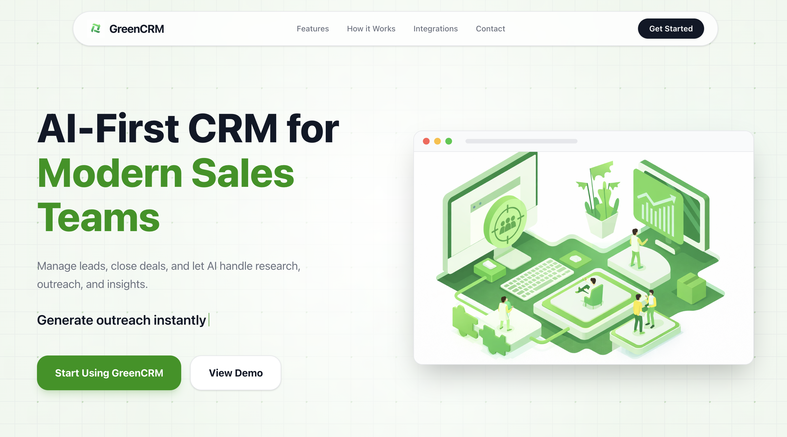
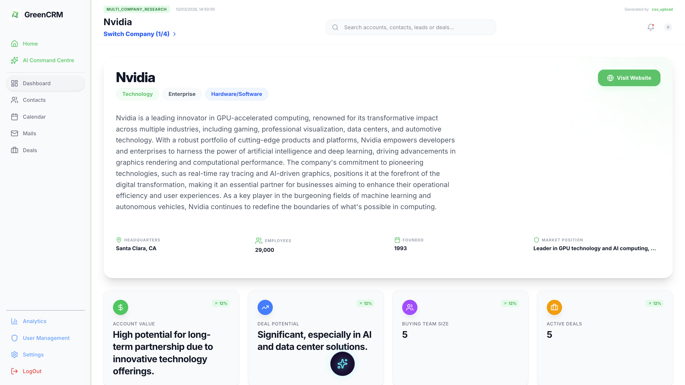
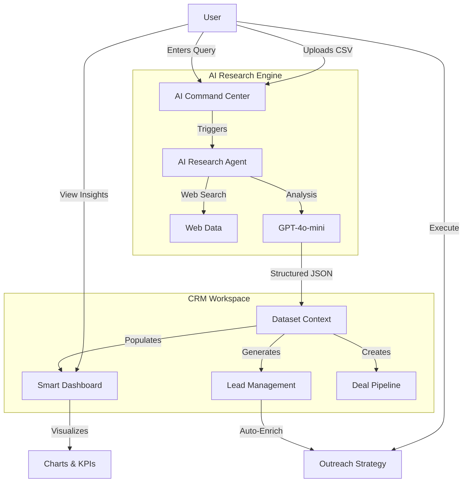

# GreenCRM - AI-First Customer Relationship Management

GreenCRM is a next-generation, AI-driven CRM platform designed to automate the heavy lifting of sales and lead management. By placing Artificial Intelligence at the core of the workflow, GreenCRM transforms simple company names into deep, actionable sales intelligence.

## 🚀 Live Demo & Video

**🌐 Try it Live:** [https://growth-os-ai-crm-student-enrollment.vercel.app](https://growth-os-ai-crm-student-enrollment.vercel.app)

## 📸 Screenshots

### Landing Page


### Dashboard


##  AI-First Core Features

### 🔍 AI Company Research & Intelligence
Stop manual searching. Enter a company name, and the AI Research Agent performs a deep-dive analysis across the web to provide:
- **Full Business Profile**: Industry, sub-industry, business model, and market segment.
- **Deep Context**: Company description, tech stack, and key use cases.
- **Financial Status**: Funding rounds, investors, and public/private status.
- **Competitive Landscape**: Automated competitor identification and market positioning.

### 🎯 AI-Driven Lead Generation & Discovery
Automatically identify the right people to talk to:
- **Contact Discovery**: Finds key decision-makers with roles and departments.
- **Contact Enrichment**: Generates realistic email formats and phone patterns.
- **Lead Scoring**: AI-calculated priority based on influence and role.
- **Buying Team Mapping**: Estimates the size and structure of the target buying team.

### � Intelligent Sales Dashboarding
A dynamic command center that visualizes your AI-enriched data:
- **Deal Probability Charts**: Radial bar charts showing the likelihood of closing.
- **Engagement Analytics**: Pie charts for contact influence and lead priority.
- **Multi-Company Management**: Seamlessly switch between different researched entities.
- **Account Value KPI**: AI-estimated value and deal potential.

### 🤖 AI Command Palette
A central terminal for all AI operations:
- **One-Click Research**: Instantly generate a full CRM dataset from a single query.
- **CSV Data Enrichment**: Upload a basic lead list, and let the AI fill in the gaps, research the companies, and "Move to Dashboard."
- **Outreach Strategy**: AI-generated messaging angles and recommended next steps.

---

## 🗺️ System Workflow



---

## 🛠️ Technical Architecture

### Frontend (Modern & Reactive)
- **React 19 & Vite**: High-performance rendering.
- **Tailwind CSS 4**: Utility-first styling with advanced design tokens.
- **Framer Motion**: Smooth, professional UI transitions.
- **Recharts**: Data visualization for sales metrics.
- **Context API**: Global state management for AI-enriched datasets.

### Backend (Fast & Secure)
- **Hono (Node.js)**: Ultra-fast, lightweight web framework.
- **Prisma ORM**: Type-safe database interactions.
- **PostgreSQL**: Reliable data persistence.
- **OpenAI Integration**: Native SDK for high-speed AI inference.
- **JWT Authentication**: Secure user sessions and protected routes.

---

## ⚙️ Setup & Installation

### 1. Environment Configuration
Create `.env` files in both `frontend` and `backend` directories using the provided `.env.example` templates.

**Key Backend Variables:**
- `DATABASE_URL`: Your PostgreSQL connection string.
- `OPENAI_API_KEY`: Your OpenAI key.
- `UPTIQ_API_KEY`: For Agent-based research services.

**Key Frontend Variables:**
- `VITE_API_BASE_URL`: URL of your running backend.

### 2. Installation
```bash
# Backend
cd backend && pnpm install

# Frontend
cd frontend && pnpm install
```

### 3. Database Sync
```bash
cd backend
pnpm db:push
pnpm dbGenerate
```

### 4. Running the App
```bash
# Start Backend (Port 9000)
cd backend && pnpm dev

# Start Frontend (Port 5173/5174)
cd frontend && pnpm dev
```

---

## 📂 Repository & Contributing

**🔗 GitHub Repository:** [https://github.com/MeAkash77/GrowthOS-AI-CRM-Student-Enrollment-Intelligence-Platform](https://github.com/MeAkash77/GrowthOS-AI-CRM-Student-Enrollment-Intelligence-Platform)

Feel free to fork the repository, submit issues, and contribute to the project!

---

## 👨‍💻 Author
**Created by Akash**
